Unityで作ったAndroidゲーム(apk)の基本的な解析、改ざん手法をやってみる。

## 実験台のゲームプロジェクト

apkの解析と改ざんを行うにしても、市販のゲームでやるのはよくないので、簡単なゲームをUnityで作ってみた。

[plumber - github.com](https://github.com/garicchi/plumber)

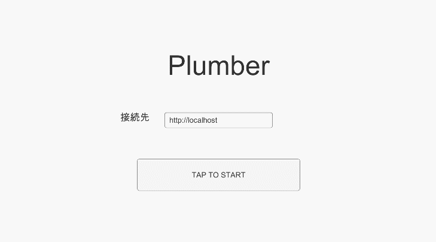

ローカルサーバーをdocker-composeで起動し、
簡単なタイトル画面とホーム画面、ゲーム画面を持つ。

タイトル画面では、マスターデータをsqliteとしてダウンロードし、読み込む。

ホーム画面では、事前にAssetBundleビルドしたpng画像をダウンロードして表示している。

今回はこのゲームのapkビルドを対象に、解析を行う。

## 事前準備

解析、改ざんを行うにしても、実際にアプリが動作しているUSBデバッグ環境を用意したい。

そこで、今回は楽天miniを使うことにした。


USBデバッグをオンにし、USBでPCと端末を接続。その後以下のコマンドでapkをインストールする。

```bash
adb install {apkのパス}
```

adbコマンドは、android sdkに付属のものを使う。[AndroidStudio](https://developer.android.com/studio)をインストールすれば付属でついてくる。

## PlayerPrefs改ざん

Unityゲームでは、簡単なデータを保存できる場所として、PlayerPrefsがある。

PlayerPrefsはstringやintなどの情報を保存できるキーバリューストアで、ユーザーIDなどを保存することが多い。

このゲームではタイトル画面でログインボタンを押したときに、PlayerPrefsにユーザーIDが無ければユーザーIDを新規作成し、PlayerPrefsに保存、ホーム画面でユーザーIDを表示している。

今回はこのユーザーIDを書き換えてみる。

### playerprefs.xmlにアクセスしてみる
PlayerPrefsの実態は以下のパスにあるxmlファイルだ。

```bash
/data/data/<パッケージ名>/shared_prefs/<パッケージ名>.playerprefs.xml
```

上記パスのパッケージ名がまだわかっていないので以下のコマンドでパッケージ名を取得しよう。

```bash
$ adb shell pm list packages | grep plumber

package:com.garicchi.plumber
```

パッケージ名は `com.garicchi.plumber` ということがわかった。

これでxmlのパスにアクセスできるのでアクセスしてみよう。

```bash
$ adb shell
C330:/ $ ls /data/data/com.garicchi.plumber/shared_prefs
ls: /data/data/com.garicchi.plumber/shared_prefs: Permission denied
```

Permission deniedと言われてしまった。

playerprefs.xmlがあるパスにアクセスするためには、root権限か、アプリの権限が必要らしい。

アプリの権限を取得するためには、 `run-as` コマンドを使用する。

```bash
$ adb shell
C330:/ $ run-as com.garicchi.plumber
run-as: package not debuggable: com.garicchi.plumber
```

`run-as` コマンドを使用しようとしたら、 `package not debuggable` と言われてしまった。

どうやら、アプリの権限を得るためには、debuggableなapkでないとダメらしい。

つまり、以下のロジックになる。
```
playerprefs.xmlを書き換えたい → アプリの権限が必要 → apkをdeuggableにする必要
```

apkをdebuggableにする方法探ろう。

### apkをdebuggableにする

apkをdebggableにするには、以下の方法をとる必要がある

- apkをPCに転送する
- apkの中身を展開する
- AndroidManifest.xmlのdebuggableをtrueに書き換える
- apkを再構築する
- apkに再署名する
- apkを端末に転送する

順にやっていこう。

まずは、apkのフルパスを `pm list packages` コマンドで取得する。
```bash
$ adb shell pm list packages -f | grep plumber
package:/data/app/com.garicchi.plumber-UDmxSP9VmrdM1Y_vSrKQkA==/base.apk=com.garicchi.plumber
```

`/data/app/com.garicchi.plumber-UDmxSP9VmrdM1Y_vSrKQkA==/base.apk=com.garicchi.plumber` がこのapkのフルパスだった。

これをadb pullしてPCに転送する。

```bash
$ adb pull /data/app/com.garicchi.plumber-UDmxSP9VmrdM1Y_vSrKQkA==/base.apk
/data/app/com.garicchi.plumber-UDmxSP9VmrdM1Y_vSrKQkA==/base.apk: 1 file pulled. 26.6 MB/s (18056211 bytes in 0.647s)
```
apkの転送に成功した。

次にこのapkの中にあるAndroidManifest.xmlを書き換えたい。

apkファイルは実質zipファイルなのでzip展開してもよいが、今回は再度apkに戻したいので、[apktool](https://ibotpeaches.github.io/Apktool/)というものを使う。

apktoolをダウンロードし、以下のコマンドでapkを展開する。

```bash
$ java -jar apktool.jar decode base.apk
```

baseというフォルダにapkが展開された。

```
base
|-- AndroidManifest.xml
|-- apktool.yml
|-- assets
|   `-- bin
|-- lib
|   `-- armeabi-v7a
|-- original
|   |-- AndroidManifest.xml
|   `-- META-INF
|-- res
|   |-- mipmap-anydpi-v26
|   |-- mipmap-mdpi
|   |-- values
|   |-- values-v21
|   `-- values-v28
`-- smali
   |-- bitter
   |-- com
   `-- org
```

展開したフォルダの中にAndroidManifest.xmlがあるので、これのapplicationタグの属性にandroid:debuggable=”true”を追加する。

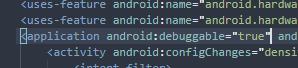

AndroidManifest.xmlの書き換えが終わったら、以下のコマンドで再びapkに戻す。
```bash
$ java -jar apktool.jar build -f base/
```

これでbase/dist/base.apkにdebuggableなapkが完成した。

これを実機に再度転送するが、Androidは未署名なapkをインストールすることができない。
apktoolで作ったapkは署名情報が消えてしまっているので、再署名が必要となる。

再署名するためにはkeystoreが必要なのでkeystoreを作成する。

keystoreを作るためには、jdk付属のkeytoolを使う。
```bash
$ export PATH=$PATH:'/c/Program Files/Java/jdk1.8.0_201/bin/'
$ keytool -genkeypair -keystore test-keystore
# パスワードは覚えていればなんでもいい
# いろいろ聞かれるけど最後の質問にyesと答えるだけでよい
```

test-keystoreを作成できたのでこれを使ってapkを再署名する。
apkに署名を行うには、JDK付属のjarsignerを使う。

```bash
$ jarsigner -keystore test-keystore base/dist/base.apk mykey
キーストアのパスワードを入力してください:
jarは署名されました。
```
これでインストール可能なapkすることができた。

次に再構築したdebuggableなapkを端末にインストールする。
```bash
# 同じパッケージ名のapkいインストールできないので先にuninstallしておく
$ adb uninstall com.garicchi.plumber
Success

$ adb install base/dist/base.apk
Performing Streamed Install
Success
```

### 再度playerpref.xmlを取得してみる

apkがdebuggableになったので `run-as` でアプリの権限を取得することができるようになり、playerprefs.xmlを見ることができるようになる。

一応playerprefsに初期値を入れるため、アプリを起動しておこう。

以下のコマンドでアプリの権限を取得する
```bash
$ adb shell
C330:/ $ run-as com.garicchi.plumber
```
今度はapkがdebuggableなので、アプリの権限を取得することができた。

続いて以下のコマンドでplayprefs.xmlを `/sdcard` にコピーする。
```bash
C330:/data/data/com.garicchi.plumber $ ls shared_prefs/
com.garicchi.plumber.v2.playerprefs.xml

cp shared_prefs/com.garicchi.plumber.v2.playerprefs.xml /sdcard/temp.xml
exit
exit
```

`/sd-card` にコピーしたファイルをadb pullでPCに転送する。
```bash
$ adb pull /sdcard/temp.xml
```

temp.xmlを開いてみると、PlayerPrefsがxmlとして保存されているのがわかる。

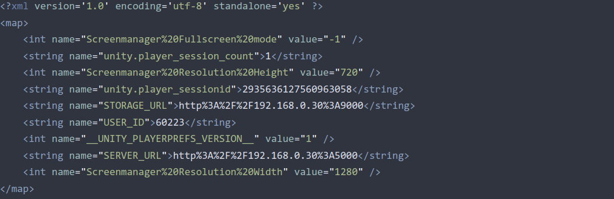

### PlayerPrefsを改ざんする

今回のゲームでは、playerprefs.xmlにあるUSER_IDというキーがユーザーIDのようなので好きな値に書き換えてみる。
```bash
<string name="USER_ID">hacked!</string>
```

書き換えることができたら、再度端末に戻す。

```bash
$ adb push temp.xml /sdcard/
temp.xml: 1 file pushed. 0.0 MB/s (644 bytes in 0.085s)
```

アプリの権限を取得して、アプリのディレクトリにコピーする。

```bash
$ adb shell
C330:/ $ run-as com.garicchi.plumber

cp /sdcard/temp.xml shared_prefs/com.garicchi.plumber.v2.playerprefs.xml
```

ゲームを再起動すると、USER IDが書き変わっていることが確認できる。(右上に改ざんした文字が表示されている)

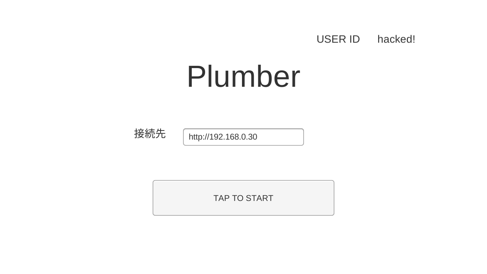

PlayerPrefsは簡易セーブデータとして便利ではあるが、このように簡単に書き換えることができてしまうので、重要なデータはPlayerPrefsに保存しないようにしたほうがよい。

## クライアントマスターデータ改ざん

先ほどのPlayerPrefsではユーザーIDを書き換えたが、実際にゲームが有利になったりはしなかった。
次はクライアントに保存されているマスターデータを改ざんし、ゲームを有利に進めてみる。

### クライアントマスターデータの取得
多くのゲームでは、ゲームを制御するデータをマスターデータとしてSQLiteで用意する。
そしてSQLiteをダウンロードしておき、そのSQLiteに書かれたデータを元に、ゲームを構築する。

今回のゲームでも、タイトル画面でログインをした時、マスターデータSQLiteとして端末にダウンロードしている。
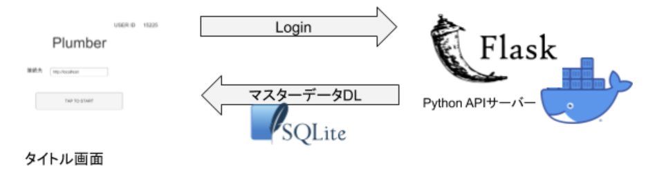

Unityでは、アプリの永続的なファイル保存先として、 `Application.persistentDataPath` というAPIを用意している。
このAPIを使うと、各OSに合わせたファイル保存先を提供してくれる。

Androidの場合、 `/storage/emulated/0/Android/data/<パッケージ名>/files` が保存先として提供される。

今回のアプリでも、`Application.persistentDataPath` を使ってSQLiteを保存したのでSQLiteを取得してみる。

```bash
$ adb pull /storage/emulated/0/Android/data/com.garicchi.plumber/files/masterdata.db
/storage/emulated/0/Android/data/com.garicchi.plumber/file...erdata.db: 1 file pulled. 0.6 MB/s (16384 bytes in 0.025s)
```

### SQLiteを書き換える
SQLiteファイルを取得できたので開いてみる。

|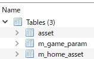|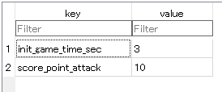|

init_game_time_secというキーはゲームの制限時間っぽく、
score_point_attackというキーはゲームのアタック時の加算されるスコアっぽい。

これを有利になるように書き換えてみる。

今回はゲームの制限時間を3秒→20秒に書き換え、加算スコアを10→1000にしてみた。

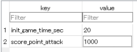

### クライアントマスターデータの再転送

SQLiteを書き換えたら　adb pushで転送しなおす。
この時、ゲームはホーム画面にいる状態で転送してください。タイトル画面にいると、ボタンを押した後に正しいマスターデータをダウンロードしなおしてしまいます。

```bash
adb push masterdata.db /storage/emulated/0/Android/data/com.garicchi.plumber/files/
```

ゲーム画面に行くと、制限時間が20秒から始まり、ATTACKボタンを押すたびに1000スコア加算されるようになった。


このように、一度端末に保存してしまったファイルは、非常に簡単に書き換えることができる。

ゲームのマスターデータを簡単に改ざんされてしまっては、簡単にチートができてしまうので、マスターデータは特に改ざんしにくくする必要がある。

代表的な例としては[SQLCipher](https://www.zetetic.net/sqlcipher/)などをつかって、SQLiteを暗号化するなどがある。

この時、復号化キーは都度サーバーから取得するようにして、クライアントには保存しないように気をつける。

クライアントに保存したり、バイナリに埋め込んだ場合、キーを解析されてしまう恐れがある。

## アセット抽出

ゲームには画像や音楽など、様々なアセットを使用する。

Unityの場合、基本的にはアセットをAssetBundleという形式に変換し、S3などから追加ダウンロードという形で取得する。

ダウンロードされたAssetBundleの中身はアセットなので、攻撃者はアセットを解析することができる。

アセットを解析されたり、改ざんされたとしてもゲームを有利に進めることは難しいが、アセットから未来の施策のネタバレさされる可能性がある。

例えば、次のゲームイベントに使う画像を、イベントが始まる前にユーザーがダウンロードしてしまうと、アセットを解析され、次のイベントが始まる前にイベントの内容をネタバレされてしまう。

今回は、AssetBundleとして追加ダウンロードされた、png画像を解析してみる。

### AssetBundleを抽出する

AssetBundleもマスターデータと同じようにApplication.persistendDataPathに保存されていると仮定して、探してみる。

```bash
$ adb shell ls /storage/emulated/0/Android/data/com.garicchi.plumber/files/
assetbundles
masterdata.db
```

assetbundlesというそれっぽいフォルダがあった。

```bash
$ adb shell
C330:/ $ cd /storage/emulated/0/Android/data/com.garicchi.plumber/files/

C330:/ $ find assetbundles
assetbundles/
assetbundles/Android
assetbundles/Android/asset01.dep
assetbundles/Android/asset01material.dep
assetbundles/Android/asset01prefab
assetbundles/Android/asset01prefab.dep
assetbundles/Android/asset01
assetbundles/Android/asset01material
assetbundles/Windows
assetbundles/Windows/asset01material
assetbundles/Windows/asset01material.dep
assetbundles/Windows/asset01prefab
assetbundles/Windows/asset01
assetbundles/Windows/asset01prefab.dep
assetbundles/Windows/asset01.dep
```

今回は `assetbundles/Android/asset01` というABを抽出してみる。

```bash
$ adb pull /storage/emulated/0/Android/data/com.garicchi.plumber/files/assetbundles/Android/asset01
/storage/emulated/0/Android/data/com.garicchi.plumber/file...id/asset01: 1 file pulled. 0.3 MB/s (2307 bytes in 0.007s)
```

AssetBudleを取得することができた。

### AssetBundleから画像を抽出する

adb pullしたファイルは、AssetBundle形式なので、素材を抽出することができる。

AssetBundleからアセットを抽出するにはいろいろなツールがあるが、[AssetStudio](https://github.com/Perfare/AssetStudio)というツールが便利だった。

AssetStudioをつかって、asset01ファイルを開くと、これはTexure2Dであることがわかり、アセットも表示された。

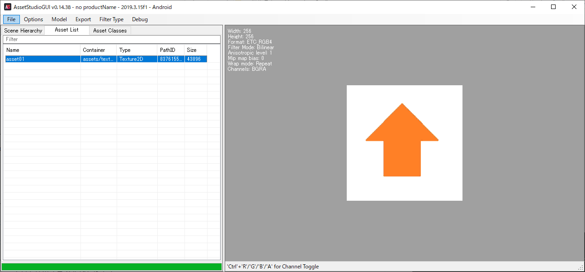

もちろんpngとして抽出することもできる。


このように、一度ダウンロードしてしまったアセットは非常に簡単に解析されてしまう。

未来の施策をネタバレされないためには、施策が始まる直前までアセットをダウンロードしないように制御することが重要である。

## mono scripting backendの改ざん

Unityのバイナリビルドでは、
ビルド時は.NetのILという中間言語までコンパイルし、実行時に機械語にコンパイルされる mono scripting backendと
ビルド時にILをC++に変換したのち、対象のアーキテクチャの機械語コードに一気にコンパイルするIL2CPP scripting backend
の2種類の方式を選択できる。

今回はmonoでアプリを作った場合、いかに簡単に解析できるかを試してみる。

### ILを逆コンパイルする
PlayerPrefs改ざんで実践したのと同じようにapkをadb pullし、apktoolで展開する。

```bash
# apkのパスを取得
$ adb shell pm list packages -f | grep plumber
package:/data/app/com.garicchi.plumber-KJYyK3FA7jih38wcAiIHtg==/base.apk=com.garicchi.plumber
# apkをpull
$ adb pull /data/app/com.garicchi.plumber-KJYyK3FA7jih38wcAiIHtg==/base.apk
/data/app/com.garicchi.plumber-KJYyK3FA7jih38wcAiIHtg==/base.apk: 1 file pulled. 22.0 MB/s (18056260 bytes in 0.784s)
# apk展開
$ java -jar apktool.jar decode base.apk
```

展開したapkのassets/bin/data/Managedフォルダの中を見ると、dllがいくつかある。

この中のAssembly-CSharp.dllにUnityで開発者が書いたC# ScriptがILに変換されたものが入っている。

```bash
base
|-- AndroidManifest.xml
|-- apktool.yml
|-- assets
|   `-- bin
|       `-- Data
|           |-- Managed
|           |   |-- Assembly-CSharp.dll  # UnityゲームのコードのILが入っているdll
|           |   |-- Mono.Security.dll
|           |   |-- System.Buffers.dll
|           |   |-- System.ComponentModel.Composition.dll
```

Assembly-CSharp.dllを解析し、中にあるILをC#のコードに逆コンパイルすればコンパイル前のコードを復元できる。
ILの逆コンパラとしては、[ILSpy](https://github.com/icsharpcode/ILSpy)などがあるが、今回はReflexilというプラグインを入れることによってILを書き換えることができる[JustDecompile](https://www.telerik.com/products/decompiler.aspx)を使う。

JustDecompileでAssembly-CSharp.dllを開いてみる。

かなり元のC#コードに近い形で復元することができた。

.NetのILは変数名や関数名などのシンボル情報を一緒に持っているため、gccなどでネイティブコンパイルされたコードを復元する場合と比べ、非常に解析しやすく、元コードを復元しやすい。

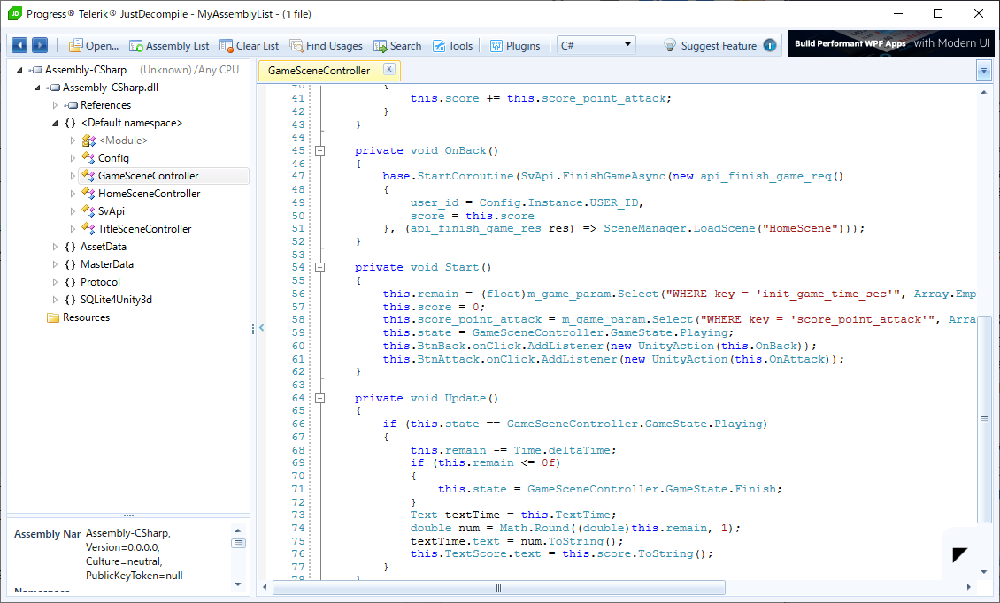

### ILを書き換える
次にILを改ざんしてみる。
JustDecompileのPlugins Managerを開き、Assembly Editorをインストールする。

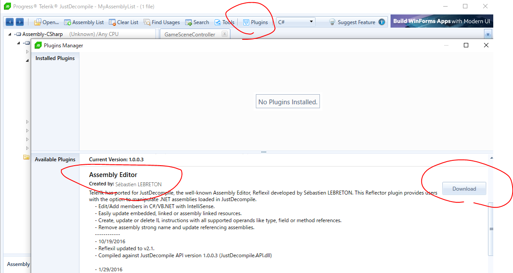

今回はGameSceneControllerクラスのUpdateメソッドを書き換えます。

Updateメソッドはこのようになっており、主にゲームの残り時間を制御している。

残り時間が0以下の場合、ゲームの状態をFinishにするような制御をしている。
この「残り時間が0以下になったらゲームの状態をFinishにするという処理」をしている
`state = GameState.Finish;`
の部分を
`state = GameState.Playing;`
に改ざんすることができれば、
「残り時間が0以下になったらゲームの状態をPlayingにするという処理」
に変えることができ、ゲームが終わらずに無限にゲームを遊べるチートができる。

```cs
void Update()
{
    if (state == GameState.Playing)  # Playing状態なら
    {
        remain -= Time.deltaTime;    # 残り時間を減らす
        if (remain <= 0)             # 残り時間が0以下なら
        {
            state = GameState.Finish;  # Finish状態にしてゲーム終了
        }
        TextTime.text = Math.Round(remain, 1).ToString();  # テキスト表示処理
        TextScore.text = score.ToString();  # テキスト表示処理
    }
}
```

ILを改ざんするためにはJustDecompileで、PluginsからReflexilを開く。

そして、左側のツリーからGameSceneControllerのUpdateメソッドをクリックする。
すると、上にC#コード、下にILコードが表示される。

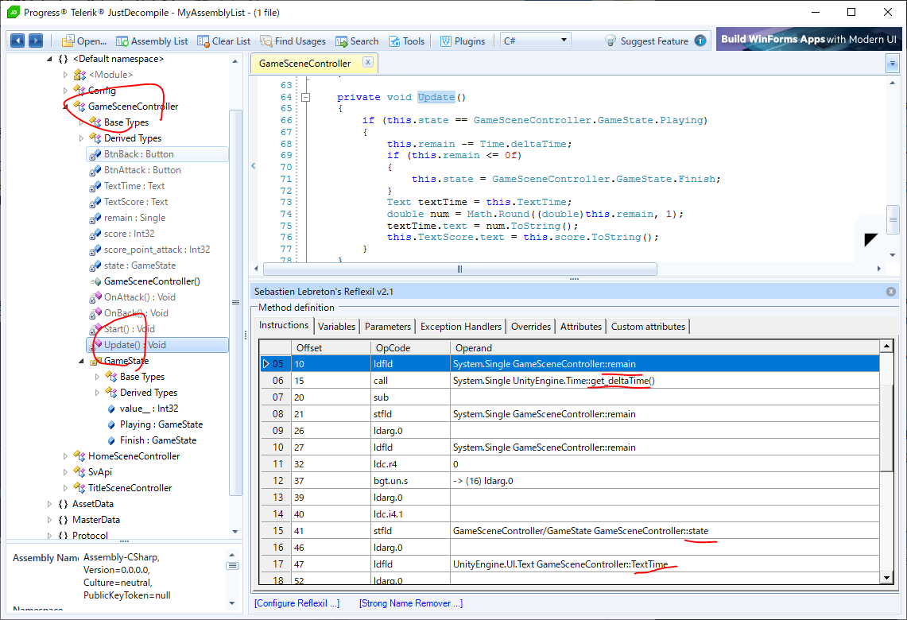

次に、書き換えたい`state = GameState.Finish;` のコードがILのどの命令かに大体当たりをつける。
`state = GameState.Finish;`はC#上では
`remain -= Time.deltaTime` と `Text textTime = this.TextTime;`
に挟まれている。

それを参考にILを追ってみると、remainやdeltaTime()とTextTimeに挟まれている`GameSceneController::state` があることがわかる。

該当のILは以下のようになっている。

```
stfld GameSceneController::state
```

[stfld命令](https://docs.microsoft.com/en-us/dotnet/api/system.reflection.emit.opcodes.stfld?view=netcore-3.1)についてググってみると、「Replaces the value stored in the field of an object reference or pointer with a new value.」とあるので、どうやら代入命令のようだ。

では何を代入しているかというと、ILも他のアセンブリ言語と同じように演算に使うパラメータは事前にスタックにいれておいて、演算を行う。
ので代入命令で代入する値は、代入命令よりも前で、スタックに積んでいるはず。

stfldの1つ前の命令を見てみましょう。

```
ldc.i4.1
```

[ldc.i4.1命令](https://docs.microsoft.com/en-us/dotnet/api/system.reflection.emit.opcodes.ldc_i4_1?view=netcore-3.1)についてググってみると「Pushes the integer value of 1 onto the evaluation stack as an int32.」とあるので、stfld命令で代入する値をスタックにpushしていると考えられる。

C#上ではstateに代入しているのはGameState::Finishであり、これはintに変換すると1なので、書き換えるべきゲームの状態を制御している命令はここと考えられる。

そしてldc.i4.1命令をldc.i4.0命令に書き換えれば、stateに0 (GameState::Playing)が代入され、ゲームを終了することなく無限に遊べそう。

ではldc.i4.1命令を右クリックしてEditしてみよう。

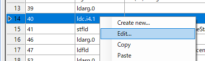
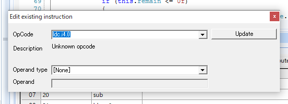

これでILの書き換えが完了したので左のツリーからAssembly-CSharp > Reflexil > Save as.. を押してdllを保存する。

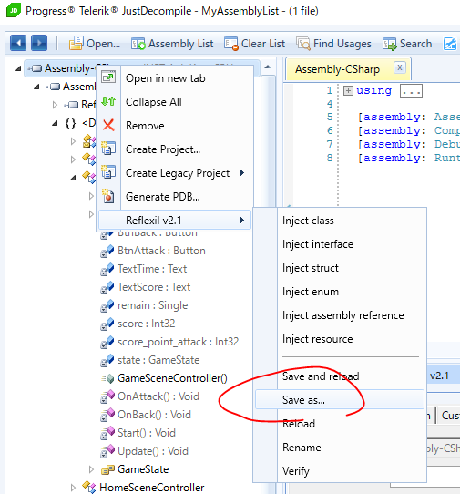

名前はAssembly-CSharp.dllとし、既存のファイルを上書きする。

JustDecompileで再度AssemblyCSharp.dllを開くと、意図通り
this.state = GameSceneController.GameState.Playing;
に書き変わっていることがわかる。

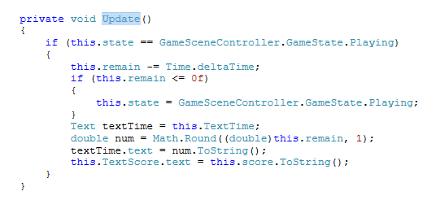

最後に、書き換えたdllを再度apkにし、実機にインストール、プレイしてみる。
手順はPlayerPrefs改ざんの時と同じ。

```bash
# apk再構築
$ java -jar apktool.jar build -f base/
# 再署名
$ jarsigner -keystore test-keystore base/dist/base.apk mykey
# アンインストール
$ adb uninstall com.garicchi.plumber
# インストール
$ adb install base/dist/base.apk
```

では実際に実機で遊んでみる。


制限時間が0になってもゲームが終了しないので無限にスコアを稼げるようになった。

このようにscripting backendをmonoにしてアプリを作った場合、非常に解析しやすく、バイナリ改ざんが容易にできてしまう。

## IL2CPP scripting backendの静的解析と改ざん

先ほどの手順で、mono scripting backendは簡単に書き換えることができてしまった。
ではscripting backendをIL2CPPにすればセキュリティ的に安全かといえばそんなことはないと思われる。
解析対象が中間言語ではなく機械語となるので、多少解析はしにくくはなりますが、改ざんが可能である。

### IL2CPPによるビルド
IL2CPPをするにはUnityのPlayerSettingsのScriptingBackendでIL2CPPを選択し、TargetArchitecturesは 32bit ARMであるARMv7を選択する。

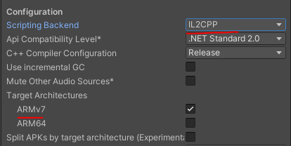

これでビルドしたapkをadb installし、adb pull、apktoolで展開する。

```bash
# apk install
$ adb install plumber.apk
Performing Streamed Install
Success

# apk パスの特定
$ adb shell pm list packages -f | grep plumber
package:/data/app/com.garicchi.plumber-CAcic8MiZ1yJqfTJu8j-BA==/base.apk=com.garicchi.plumber

# apkをpullする
$ adb pull /data/app/com.garicchi.plumber-CAcic8MiZ1yJqfTJu8j-BA==/base.apk

# apk展開
$ java -jar apktool.jar decode -f base.apk
```

IL2CPPでビルドされたapkを展開してみると、以下のようなファイル構成になっている。

```bash
base
|-- AndroidManifest.xml
|-- apktool.yml
|-- assets
|   `-- bin
|       `-- Data
|           |-- Managed
|           |   |-- Metadata
|           |   |   `-- global-metadata.dat  # 開発者が書いたゲームコードのシンボル情報など
|           |   |-- Resources
|           |   |   `-- mscorlib.dll-resources.dat
|           |   `-- etc
|           |       `-- mono
|           |-- boot.config
|           |-- data.unity3d
|           `-- unity default resources
|-- lib
|   `-- armeabi-v7a
|       |-- libil2cpp.so  # 開発者が書いたゲームコードの機械語コード
|       |-- libmain.so
|       |-- libsqlite3.so
```

`lib/armeabi-v7a`のパスにある`libil2cpp.so`ファイルが開発者が書いたC#ゲームコードが機械語にコンパイルされたものである。
しかしながらIL2CPPのコンパイルはmono(IL)と違い、関数名や変数名などのシンボル情報は実行に必要な情報ではないので削除されている。

IL2CPPの静的解析の目的としては、このlibil2cpp.soの機械語コードを逆コンパイルして処理内容を把握することだが、変数名や関数名がわからないと、解析が大変になる。

IL2CPPでビルドされたapkは`assets/bin/Data/Managed/Metada`にある`global-metadata.dat`に関数名や変数名のシンボル情報が保存されているのでこの情報を利用すれば解析が楽になる。

とはいえ、global-metadata.dat自体も解析しなければいけないのでツールを使ってみる。
[il2CppDumper](https://github.com/Perfare/il2CppDumper)というツールを使うと、`global-metadata.dat`と`libil2cpp.so`を入力として、機械語のどの命令がどの関数や変数に対応しているのかを出力してくれます。

実際にシンボルをダンプしてみる。

```bash
$ mkdir dump
$ ./Il2CppDumper.exe base/lib/armeabi-v7a/libil2cpp.so base/assets/bin/Data/Managed/Metadata/global-metadata.dat dump
```

ダンプされた中身はこんな感じ。

```bash
dump
|-- DummyDll
|   |-- Assembly-CSharp.dll
|-- dump.cs
|-- il2cpp.h
|-- script.json
`-- stringliteral.json
```

この中にある`script.json`を逆アセンブラで読み込むと、アセンブリ命令にシンボル情報をマップできる。

### 逆コンパイラで読み込む
逆アセンブラとしては[IDA](https://www.hex-rays.com/products/idahome/)が有名だが、こちらはARMの逆アセンブルをしようと思うと課金(4万円)が必要なので、無料で使える[Ghidra](https://ghidra-sre.org/)という逆アセンブラを使う。

Ghidraを開いたらNew Projectでプロジェクトを作り、Import Fileでlibil2cpp.soを開く。

初回解析時には、analyzeするか聞いてくるが、analyzeしておく。5分ぐらいかかる。

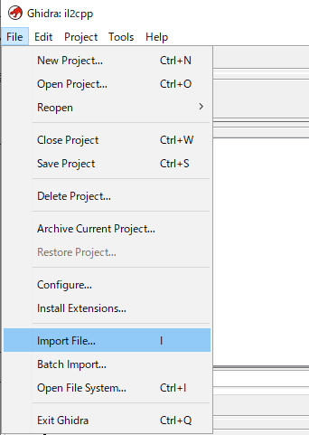

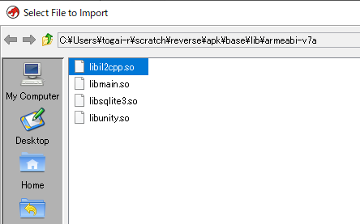

解析が完了したらざっとアセンブリコードを見てみる。
機械語よりはわかりやすいが、ここからC#のコードを推測するのは結構困難。

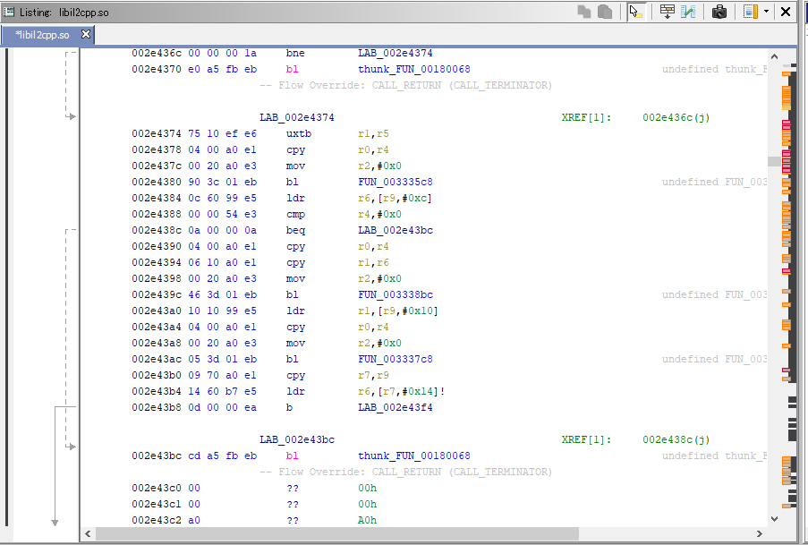

そこで先ほどIl2CppDumperでダンプしたjsonを食わせる。

まずは`script.json`を食わせるためのGhidra用Pythonスクリプトを、Ghidraが認識できる位置に配置する
Il2CppDumperに付属している`ghidra.py`を`~/ghidra_scripts`に配置します。

ScriptManagerを開き、配置した`ghidra.py`をダブルクリックし、実行する。

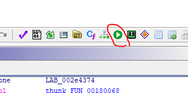

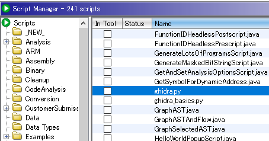

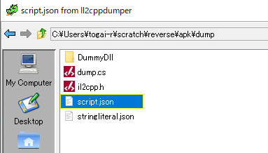

シンボルが読み込まれ、どのラベルがどの関数かがおおよそわかるようになった。

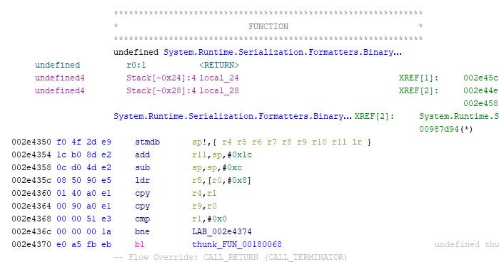

### IL2CPPバイナリの改ざん

今回も改ざん対象はmono scripting backendの静的解析と改ざんと同じ、GameSceneControllerクラスのUpdate関数とする。

Ghidraの`Search Program Text`を起動し、`GameSceneController`と入力する。Fieldsは`Functions`にチェックを入れ、`Search All` をクリックする。

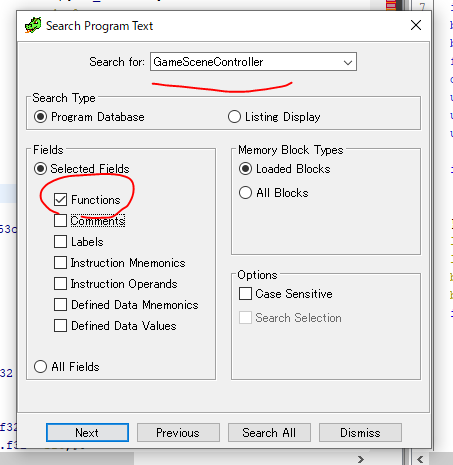

検索結果によると、GameSceneControllerのUpdateメソッドは`0079d4fc番地`にあることがわかる。
ダブルクリックしてジャンプしてみる。

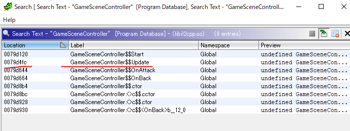

GameSceneControllerのUpdateメソッドに飛ぶことができた。右側の逆コンパイルされたC++コードを見てもそれっぽいことがわかる。

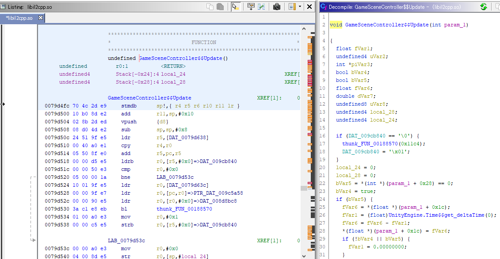

mono scripting backendの静的解析と改ざんの時と同じように、`state = GameState.Finish;`を探す。

元コードは以下のような感じなので、`deltaTime`と`Math.Round`に挟まれている処理を探す。

```cs
void Update()
{
    if (state == GameState.Playing)  # Playing状態なら
    {
        remain -= Time.deltaTime;    # 残り時間を減らす
        if (remain <= 0)             # 残り時間が0以下なら
        {
            state = GameState.Finish;  # Finish状態にしてゲーム終了
        }
        TextTime.text = Math.Round(remain, 1).ToString();  # テキスト表示処理
        TextScore.text = score.ToString();  # テキスト表示処理
    }
}
```

Time.deltaTimeとMath.Roundに挟まれている処置を以下に示す。

```s
;; Time.deltaTimeの呼び出し
0079d55c 34 76 fb eb 	bl     	UnityEngine.Time$$get_deltaTime
0079d560 10 0a 00 ee 	vmov   	s0,r0
;; remain -= Time.deltaの減算処理っぽい
0079d564 40 8a 38 ee 	vsub.f32   s16,s0
;; if (remain <= 0)の分岐命令っぽい
0079d568 c0 8a b5 ee 	vcmpe.f32  s16,#0
0079d56c 07 8a 84 ed 	vstr.32	s16,[r4,#0x1c]
0079d570 10 fa f1 ee 	vmrs   	pc,fpscr
0079d574 01 00 a0 93 	movls  	r0,#0x1
0079d578 28 00 84 95 	strls  	r0,[r4,#0x28]
0079d57c bc 00 9f e5 	ldr    	r0,[DAT_0079d640]
;; Math.Roundを使ってる感
0079d580 00 00 9f e7 	ldr    	r0,[pc,r0]=>->Class$System.Math
0079d584 14 50 94 e5 	ldr    	r5,[r4,#0x14]
0079d588 00 00 90 e5 	ldr    	r0,[r0,#0x0]=>Class$System.Math
0079d58c bb 10 d0 e5 	ldrb   	r1,[r0,#0xbb]
0079d590 02 00 11 e3 	tst    	r1,#0x2
0079d594 03 00 00 0a 	beq    	LAB_0079d5a8
0079d598 74 10 90 e5 	ldr    	r1,[r0,#0x74]
0079d59c 00 00 51 e3 	cmp    	r1,#0x0
0079d5a0 00 00 00 1a 	bne    	LAB_0079d5a8
0079d5a4 4a c1 e8 eb 	bl     	thunk_FUN_001817d8        	 
                 	LAB_0079d5a8                             	 
0079d5a8 c8 0a f7 ee 	vcvt.f64   d16,s16
0079d5ac 01 20 a0 e3 	mov    	r2,#0x1
0079d5b0 00 30 a0 e3 	mov    	r3,#0x0
0079d5b4 30 0b 51 ec 	vmov   	r0,r1,d16
0079d5b8 05 bc ec eb 	bl     	System.Math$$Round      
```

大まかに処理にあたりをつけ、`state = GameState.Finish;`っぽいところを抜き出すと以下になる。

```s
;; r0レジスタに#0x01を書き込む
0079d574 01 00 a0 93 	movls  	r0,#0x1
;; r0の値をメモリのr4 + #0x28のアドレスに書き込む
0079d578 28 00 84 95 	strls  	r0,[r4,#0x28]
```

命令の後ろについている`ls`は命令実行と同時にフラグレジスタを制御するsuffixなので無視して大丈夫。
[mov](http://infocenter.arm.com/help/index.jsp?topic=/com.arm.doc.dui0204j/Cihcdbca.html)はレジスタに値を書き込む命令で、[str](http://infocenter.arm.com/help/index.jsp?topic=/com.arm.doc.dui0552a/BABFGBDD.html)はメモリに値を書き込むストア命令。

どうやら、`0079d578番地`でメモリに書き込み、メモリに書き込む値は`0079d574番地`で指定されており、それは`0x01`らしい。

mono scripting backendの時と同様に、`GameState::FinishをGameState::Playing` に置き換えれば無限にスコアを稼げるチートができるので、`0079d574番地`の命令を以下に置き換えてみる。

```s
01 00 a0 93     movls      r0,#0x1
↓
00 00 a0 93     movls      r0,#0x0
```

armv7は[リトルエンディアンっぽい(little as default)](https://en.wikipedia.org/wiki/ARM_architecture)ので機械語コードの先頭部分がオペランドになる。

`01`が`0x01`なのでこれを`00`にする。

Ghidra力が足りなくてGhidraでのアセンブリ書き換えがなぜかうまくいかなかったので今回は普通にバイナリエディタで書き換えてみた。

Windowsで有名なバイナリエディタであるStrlingでlibil2cpp.soを開く。

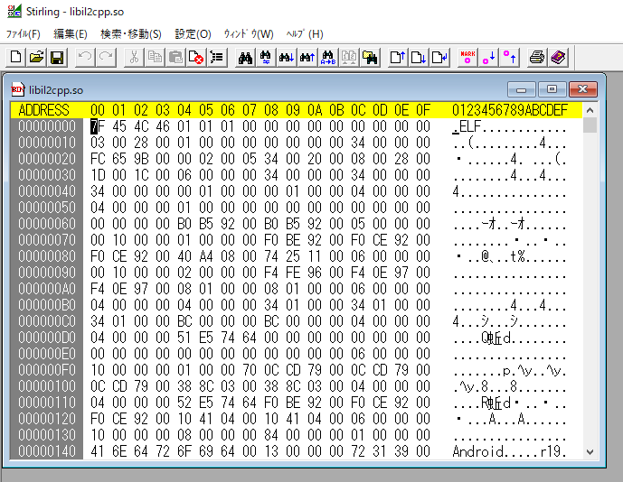

検索 > 指定アドレスへ移動で書き換えたいmov命令がある`0079d574`まで移動するが、ここで注意しなければいけないのはGhidraは`Image Baseありのアドレス`で表示していることだ。

Image Baseとは機械語コードがメモリにロードされたときのOffsetのようなものだが、GhidraのMemory Mapを見るとImage Baseが`00010000`となっていることがわかる。

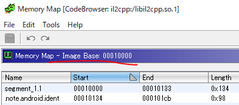

のでGhidraはこのオフセット分加算されたアドレスが表示されている。

実際のアドレスは
`0079d574`から`10000`を引いた`0078d574`
となる。

このアドレスをStrlingで開いてみる。

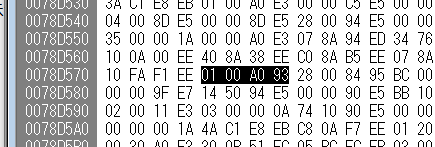

`01 00 A0 93` を見つけた。

これを`00 00 A0 93`に書き換える。

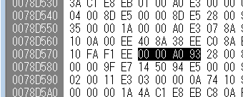

書き換えたらlibil2cppに上書き保存する。

### 改ざんしたapkで遊ぶ

これで改ざんが完了してたので同様に、apk再構築、再署名、再インストールを行う。

```bash
# apk再構築
$ java -jar apktool.jar build -f base/
# 再署名
$ jarsigner -keystore test-keystore base/dist/base.apk mykey
# アンインストール
$ adb uninstall com.garicchi.plumber
# インストール
$ adb install base/dist/base.apk
```

残り時間が0になってもゲームが終了しないので無限にスコアを稼げるようになった。

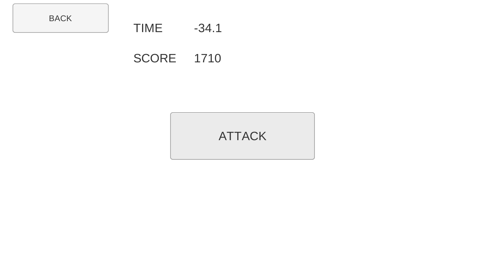

このように、IL2CPP化したバイナリであっても、解析が可能となる。

対策としては、バイナリ難読化などが有効となる。

## 動的解析によるメモリ改ざん

今までのチート手法はapkを解析する静的解析だったが、よく用いられるチート手法として、メモリ改ざんのような動的解析がある。

メモリ改ざんは、Android上でアプリを起動し、そのアプリのメモリの変化を観察し、チートしたいメモリを特定、そしてメモリを書き換えることによりチートを行う。

Android上でメモリ改ざんもやりたかったのですが、root化したandroidを用意しなければいけないなどハードルが高かったので今回はUnityでWindowsゲームとしてビルドし、Windowsゲームのメモリ改ざんを行ってみる。

多少ツールは違うが、基本的な考え方はAndroidもWindowsも同じなはずである。


Windowsプログラムのメモリ改ざんを行うには、[うさみみハリケーン](https://www.vector.co.jp/soft/win95/prog/se375830.html)などのプロセスメモリエディタを使います。
Androidの同様なツールとしては、[GameGurdian](https://gameguardian.net/)などがあります。

### 動的にメモリを書き換える

UnityでWindows向けにゲームをビルドしたら、exeを起動し、うさみみハリケーンでアタッチする。


ゲーム画面で、ATTACKボタンを数回押してスコアを20にしておく。

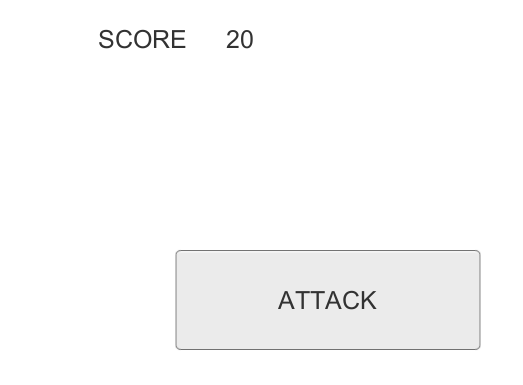

うさみみハリケーンで `検索 > メモリ範囲を指定して検索`を押す。
検索ボックスに現在のスコア値である`20`を入力し、検索を行う。

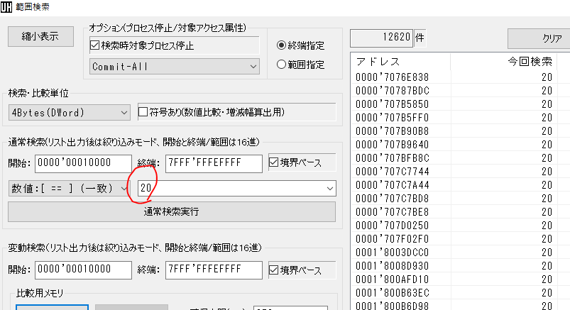

右側に`20`という値を持っているメモリ一覧がでてくる。
しかし20の値を持つメモリはたくさん存在し、どのメモリが改ざんしたいスコアのメモリかわからない。

そこでさらにATTACKボタンを押して、スコアを`50`まで進める。

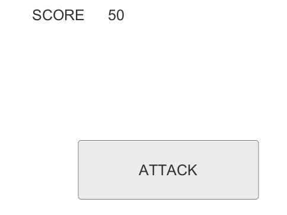

その後、もう一度範囲検索のウインドウに戻り、今度は`50`を入力して検索を行う。

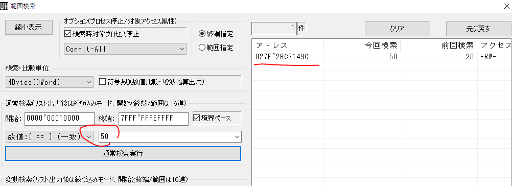

すると、前回検索時の値が20で、今回検索時に値が50になったメモリが列挙される。

結果、スコアを保存しているメモリは `027E2BC9149C`であることがわかった。

あとはメモリの`027E2BC9149C`番地の値を書き換えるだけ。テキトーにFを押して書き換えてみる。

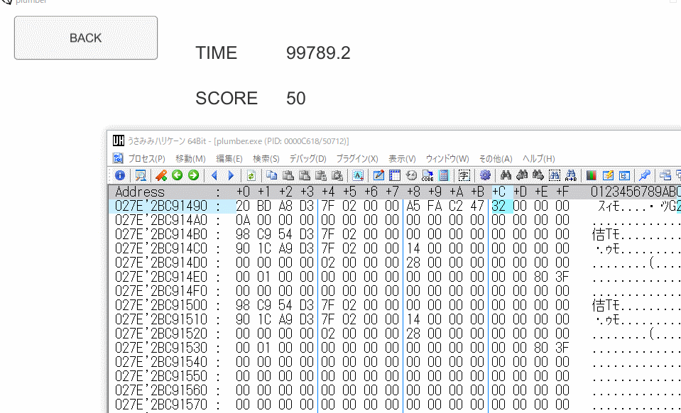

スコアの値を改ざんし、非常に高いスコアを記録することができた。

Androidの場合も、root化は必須ではあるが、同じような方法で改ざんを行うことができる。

対策としては、大半ののプロセスメモリエディタはroot化をしないと他のプロセスをみることができないため、root化を検知してroot化されていた場合はアプリの起動を抑止するなどがある。

また、表示されている値とメモリに入っている値をXORなどで変換するなども有効である。

## 参考資料

- [Why do I get access denied to data folder when using adb? - StackOverflow](https://stackoverflow.com/questions/1043322/why-do-i-get-access-denied-to-data-folder-when-using-adb)
- [セキュリティエンジニアからみたUnityのこと - LINE Enginner Blog](https://engineering.linecorp.com/ja/blog/unity-from-a-security-engineer-point-of-view/)
- [Difference between unity scripting backend IL2CPP and Mono2x](https://gamedev.stackexchange.com/questions/140493/difference-between-unity-scripting-backend-il2cpp-and-mono2x)
- [SECCON 2018 x CEDEC CHALLENGE ゲームセキュリティチャレンジ - Harekaze - SpeakerDeck](https://speakerdeck.com/st98/seccon-2018-x-cedec-challenge-gemusekiyuriteitiyarenzi-harekaze?slide=22)
- [スマホゲームのチート手法とその対策 [DeNA TechCon 2019]](https://www.slideshare.net/dena_tech/dena-techcon-2019-132194701)
- [リバースエンジニアリングバイブル - インプレスブック](https://book.impress.co.jp/books/1113101030)
- [たのしいバイナリの歩き方 - 技術評論社](https://gihyo.jp/book/2013/978-4-7741-5918-8)
